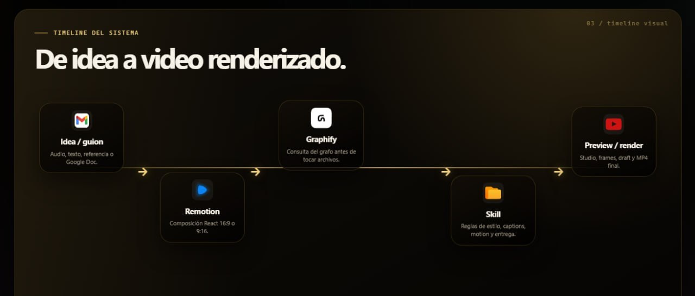

# Remotion Editor Kit Wizard

Repositorio público para instalar un **editor de video real con Remotion**, no solo un wizard de carpetas.

El kit crea un workspace completo con:

- **Remotion** como motor de edición, preview y render.
- **Graphify** como mapa del codebase para que el agente entienda el proyecto antes de tocar archivos.
- **Hyperframes** como capa de motion graphics para tarjetas, overlays, diagramas y escenas HTML animadas.
- **25 componentes Remotion** reutilizables.
- **9 templates reales** para piezas sociales, contenido, presentaciones y edición talking-head.
- **scripts de pipeline** para análisis de video, audio, transcripción, silencios, background removal y batch render.
- **skills/reglas para agentes IA** con preview visible, Graphify-first y seguridad pública.

Este recurso está basado en el sistema interno **Editor Pro Max**, adaptado como starter público limpio: sin rutas privadas, sin guiones internos de producción, sin assets personales y sin comandos destructivos.



## Quick start

```bash
git clone https://github.com/SikJa/remotion-graphify-setup-wizard.git
cd remotion-graphify-setup-wizard
npm run doctor
npm run setup
```

El wizard te pregunta el nombre, carpeta raíz, tipo de contenido, formato, duración, recursos, inbox, finales, scratch/cache, subtítulos, estilo visual, agente objetivo, Graphify y preview.

Cuando elegís instalar el editor completo, crea:

```text
<workspace>/
  Inbox/
  Recursos/
  Assets Pesados/
  Remotion/
    <tu-editor>/
      src/components/
      src/templates/
      src/hyperframes/
      scripts/
      hyperframes/
      skills/video-editor-agent/
      AGENTS.md
      package.json
      remotion.config.ts
      tsconfig.json
  Publicaciones/
  Videos Finales/
  Renders Viejos/
  Backups/
  Scratch/
  graphify-out/
```

## Qué incluye el editor

### Componentes Remotion

Incluye componentes para:

- texto animado;
- captions y subtítulos;
- lower thirds;
- overlays;
- CTA;
- progreso/countdown;
- video/audio/image fitting;
- jump cuts;
- slideshow;
- picture-in-picture;
- split screen;
- safe areas;
- fondos gradiente/grid/particles/color wash;
- callout cards;
- flechas/labels;
- motion cards Hyperframes.

### Templates reales

- TikTok Video
- Instagram Reel
- YouTube Short
- Talking Head Edit
- Podcast Clip
- Presentation
- Testimonial
- Announcement
- Before/After

### Scripts de pipeline

```bash
npm run analyze:video
npm run extract:audio
npm run transcribe
npm run detect:silence
npm run remove:bg
npm run render
npm run clean:remotion-temp
npm run disk:report
```

### Hyperframes incluido

Hyperframes no queda como extra opcional. El starter trae:

- `hyperframes/motion-card.html`
- `hyperframes/README.md`
- `src/hyperframes/HyperframeMotionCard.tsx`
- `npm run hyperframes:lint`
- `npm run hyperframes:validate`

Usalo para motion graphics: tarjetas, diagramas, flechas, mapas de proceso, overlays técnicos y transiciones editoriales.

### Graphify incluido

El wizard intenta instalar/configurar Graphify y deja reglas para agentes:

```bash
graphify hermes install
graphify claude install
graphify .
graphify query "cómo está organizado este editor"
```

Si Graphify no está en PATH, el workspace se crea igual y te deja el paso pendiente.

## Requisitos

Obligatorios:

- Node.js 20+
- npm
- Git

Recomendados:

- Python 3.10+ para Graphify (`graphifyy`)
- FFmpeg

## Comandos útiles

En la raíz del repo:

```bash
npm run doctor
npm run setup
npm run questions
npm run clean
npm run clean:apply
```

Dentro del editor generado:

```bash
npm install
npm run typecheck
npm run dev
# Remotion Studio: http://127.0.0.1:3010
```

## Seguridad pública

Este repo está pensado para audiencia externa. No debe incluir:

- rutas internas de creadores;
- scripts de grabación privados;
- prompts internos de producción;
- assets personales;
- comandos de limpieza agresivos;
- material de clientes;
- notas no publicables.

## Documentación

- `docs/editor-kit.md`
- `docs/hyperframes.md`
- `docs/folder-system.md`
- `docs/questions.md`
- `docs/cache-hygiene.md`

## Licencia

MIT.
