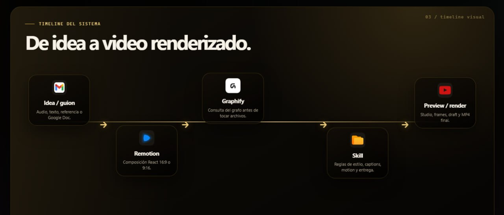
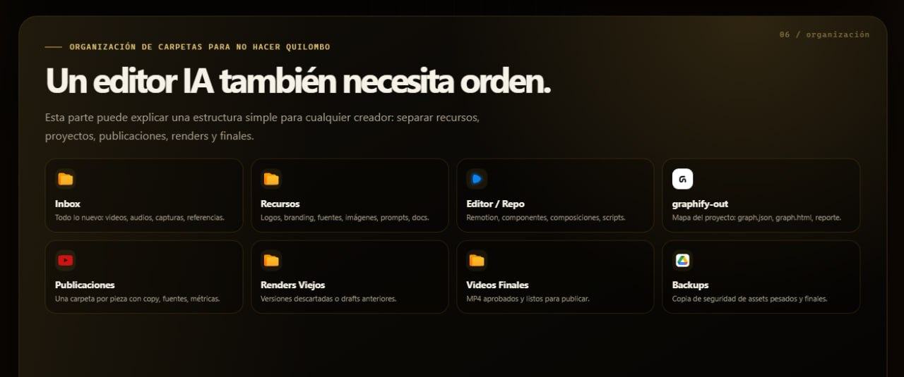

# Remotion + Graphify Setup Wizard

Repositorio público para instalar y configurar un workspace de video con **Remotion**, **Graphify**, una **skill operativa** y un sistema de carpetas limpio.

La idea: no instalar Remotion “a ciegas”. Primero el wizard te pregunta para qué lo vas a usar, dónde van tus recursos, qué formatos necesitás, cómo vas a renderizar, dónde guardar cachés y cómo evitar que Remotion/webpack/temporales te llenen el disco.



## Qué crea

- Un proyecto Remotion o un workspace listo para crearlo.
- Una estructura de carpetas para producción de video.
- `AGENTS.md` con reglas para agentes IA.
- `skills/remotion-graphify-setup/SKILL.md` como guía reutilizable del flujo.
- `remotion-system.config.json` con tus respuestas.
- Scripts para revisar dependencias y auditar cachés/temporales de forma segura.
- Integración con Graphify: si elegís instalar/indexar intenta instalar `graphifyy`, corre `graphify hermes install`, `graphify claude install` y, si corresponde, `graphify .`.

## Quick start

```bash
git clone https://github.com/SikJa/remotion-graphify-setup-wizard.git
cd remotion-graphify-setup-wizard
npm run doctor
npm run setup
```

Si ya clonaste el repo y querés ver solo las preguntas:

```bash
npm run questions
```

## Requisitos

Obligatorios:

- Node.js 20+
- npm
- Git

Recomendados / instalables por el wizard:

- Python 3.10+ para instalar Graphify automáticamente.
- Graphify (`graphifyy`): si elegís `instalar+indexar`, el wizard intenta instalarlo con `uv tool install graphifyy` o `python -m pip install --user graphifyy`.
- FFmpeg

El wizard detecta lo que falta y te dice qué instalar. También acepta rutas estilo Windows (`C:/Users/...`) y Git Bash/MSYS (`/c/Users/...`).

## Las 15 preguntas del wizard

El wizard no pregunta por preguntar: cada respuesta se guarda en `remotion-system.config.json` y en las reglas del workspace para que Remotion, Graphify y el agente IA trabajen con contexto.

1. **Nombre del proyecto**: se usa para nombrar el workspace, la configuración y el proyecto Remotion.
2. **Carpeta raíz**: define dónde se crea todo el sistema: recursos, renders, Remotion, reglas y configuración.
3. **Uso principal**: le da contexto al agente; no se organiza igual un Reel que un video largo, curso o ad.
4. **Formato principal**: define diseño y composición: 9:16 para Reels/Shorts/TikTok, 16:9 para YouTube, multi para adaptación.
5. **Duración típica**: ayuda a estimar ritmo, subtítulos, renders y peso de temporales.
6. **Fuente de material**: indica si el flujo viene de cámara, pantalla, audios, documentos, clips o assets.
7. **Carpeta de recursos existentes**: conecta logos, fuentes, imágenes, música o screenshots que ya tengas; si queda vacío crea `Recursos/`.
8. **Carpeta Inbox**: entrada de material nuevo sin ordenar para procesarlo después.
9. **Carpeta de finales**: salida limpia para MP4 aprobados/listos, sin mezclar drafts.
10. **Carpeta scratch/cache**: temporales pesados de Remotion/webpack/renders; conviene separarla para cuidar el disco.
11. **Subtítulos/transcripción**: define si el sistema usará Whisper, revisión manual, captions selectivos o ninguno.
12. **Estilo visual**: deja criterio escrito para que el agente no improvise el look de cada pieza.
13. **Agente IA objetivo**: prepara reglas para Hermes, Claude Code, ambos u otro flujo.
14. **Graphify**: default recomendado `instalar+indexar`; instala/configura Graphify y crea el mapa del proyecto para que el agente entienda relaciones antes de tocar archivos.
15. **Gestión de caché/temporales**: define cómo revisar temporales sin tocar recursos, videos finales ni el proyecto principal; `npm run clean` es dry-run y `npm run clean:apply` aplica solo sobre carpetas conocidas de caché/temp.

Después pregunta dos acciones finales:

- **Crear proyecto Remotion ahora**: si elegís `yes`, corre `npx create-video@latest`. Puede abrir preguntas propias; elegí una plantilla simple/minimal si no estás seguro.
- **Levantar Remotion Studio al final**: deja indicado cómo abrir el preview local para revisar antes de renderizar.

## Sistema de carpetas recomendado



```text
<workspace>/
  Inbox/              # material nuevo sin procesar
  Recursos/           # logos, branding, fuentes, imágenes, docs
  Assets Pesados/     # videos grandes, capturas, raw media
  Remotion/           # proyecto Remotion
  Publicaciones/      # una carpeta por pieza publicada
  Videos Finales/     # MP4 aprobados
  Renders Viejos/     # drafts y versiones descartadas
  Backups/            # copias de seguridad
  Scratch/            # temporales controlados
  graphify-out/       # grafo del proyecto si Graphify corre en la raíz
```

## Comandos útiles después del setup

```bash
# revisar entorno
npm run doctor

# crear/configurar workspace
npm run setup

# auditoría segura, dry-run por defecto
npm run clean

# aplicar solo después de revisar la lista
npm run clean:apply
```

Dentro del proyecto Remotion creado:

```bash
npm run dev
# abre Remotion Studio, por defecto http://127.0.0.1:3000 o el puerto elegido
```

## Buenas prácticas incluidas

- Preview visible antes de render final.
- Graphify antes de explorar profundamente el codebase.
- Separación entre recursos, renders, finales y temporales.
- Cache/scratch separado cuando hay videos pesados.
- Auditoría dry-run antes de aplicar cualquier limpieza.
- `Renders Viejos` para archivar drafts sin mezclarlos con finales.
- `Publicaciones` con una carpeta por pieza.

## Nota sobre Graphify

Graphify se instala como paquete Python llamado `graphifyy`, pero el comando que usás es:

```bash
graphify .
graphify query "cómo está organizado este repo"
```

Para agentes:

```bash
graphify hermes install
graphify claude install
```

## Licencia

MIT.
